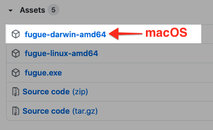
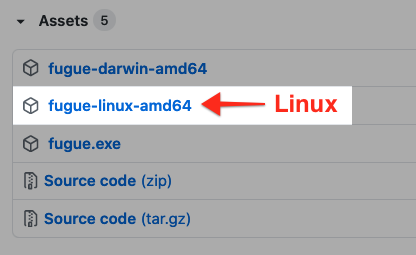
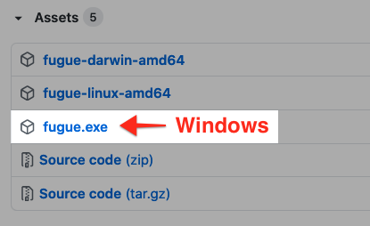

# Fugue API Client

This is a command line client for the [Fugue](https://riskmanager.fugue.co/) API.

For CLI documentation and examples, see the [Fugue docs site](https://docs.fugue.co/cli.html).

For information about enabling a client in your account, see
the [API User Guide](https://docs.fugue.co/api.html). More details of the underlying Swagger API are available
[here](https://docs.fugue.co/_static/swagger.html).

This project is under active development and is not yet stable. Commands will
change as we incorporate feedback.

## Install

The easiest way to install the client is to download a prebuilt binary
from [the releases page](https://github.com/fugue/fugue-client/releases).

Detailed installation steps are below:

- [macOS](#macos)
- [Linux](#linux)
- [Windows](#windows)

You can also [build from source.](#build-from-source)

For more information, see the [CLI documentation](https://docs.fugue.co/cli.html#installation).

### macOS

1. Select the prebuilt `fugue-darwin-amd64` binary from the [releases page](https://github.com/fugue/fugue-client/releases) and **save it to disk** (do not open it):



2. `cd` into the directory where you downloaded `fugue-darwin-amd64`.

3. Rename the binary `fugue` and move it to a location in your `$PATH`, such as `/usr/local/bin`. You can do both with the following command:

```bash
mv fugue-darwin-amd64 /usr/local/bin/fugue
```

4. Change file permissions to enable execution:

```bash
chmod 755 /usr/local/bin/fugue
```

5. Set environment variables [FUGUE_API_ID and FUGUE_API_SECRET](http://docs.fugue.co/api.html#api-client-id-secret):

```bash
export FUGUE_API_ID=61ae1bed-1b6f-1234-5678-1a2b3c4d5e6f
export FUGUE_API_SECRET=f7a89ac99cab9dd2948712345678901234567890
```

6. You should be able to run the `fugue` executable now:

```bash
fugue
```

If you get an error message that the application cannot be opened, see [these instructions](https://docs.fugue.co/cli.html#cli-install-error).

### Linux

1. Select the prebuilt `fugue-linux-amd64` binary from the [releases page](https://github.com/fugue/fugue-client/releases) and **save it to disk** (do not open it):



2. `cd` into the directory where you downloaded `fugue-linux-amd64`.

3. Rename the binary `fugue` and move it to a location in your `$PATH`, such as `/usr/local/bin`. You can do both with the following command:

```bash
sudo mv fugue-linux-amd64 /usr/local/bin/fugue
```

4. Change file permissions to enable execution:

```bash
chmod 755 /usr/local/bin/fugue
```

5. Set environment variables [FUGUE_API_ID and FUGUE_API_SECRET](http://docs.fugue.co/api.html#api-client-id-secret):

```bash
export FUGUE_API_ID=61ae1bed-1b6f-1234-5678-1a2b3c4d5e6f
export FUGUE_API_SECRET=f7a89ac99cab9dd2948712345678901234567890
```

6. You should be able to run the `fugue` executable now:

```bash
fugue
```

### Windows

1. Download the prebuilt `fugue.exe` binary from the [releases page](https://github.com/fugue/fugue-client/releases) and **save it to disk** (do not open it):



2. Open up **cmd** (Windows Command Shell) and create the directory `C:\Fugue\bin`:

```
md C:\Fugue\bin
```

3. `cd` into the directory where you downloaded `fugue.exe` and move the binary to `C:\Fugue\bin`:

```
move fugue.exe C:\Fugue\bin
```

4. Update `PATH` environment variable to add the new directory to your user path:

```
setx PATH "%PATH%;C:\Fugue\bin"
```

5. Set environment variables [FUGUE_API_ID and FUGUE_API_SECRET](http://docs.fugue.co/api.html#api-client-id-secret):

```
setx FUGUE_API_ID 61ae1bed-1b6f-1234-5678-1a2b3c4d5e6f
setx FUGUE_API_SECRET f7a89ac99cab9dd2948712345678901234567890
```

6. Close the cmd window and open a new one so the environment variables take effect.

7. You should be able to run the `fugue` executable now:

```
fugue --version
```

## Environment Variables

The client uses the following _required_ environment variables:

- `FUGUE_API_ID` - your API [client ID](http://docs.fugue.co/api.html#api-client-id-secret)
- `FUGUE_API_SECRET` - your API [client secret](http://docs.fugue.co/api.html#api-client-id-secret)

## Build from Source

Install Go:

```
brew install go
```

Build the client executable:

```
make build
```

Install to \$GOPATH/bin:

```
make install
```

## Usage

Show usage:

```
fugue -h
```

```
Fugue API Client

Usage:
  fugue [command]

Available Commands:
  create      Create a resource
  delete      Delete a resource
  get         Retrieve a resource
  help        Help about any command
  list        List a collection of resources
  scan        Trigger a scan
  sync        Sync files to your account
  update      Update a resource

Flags:
  -h, --help      help for fugue
      --json      outputs the Fugue API JSON response
      --version   version for fugue

Use "fugue [command] --help" for more information about a command.
```

### Command Documentation

- [create](https://docs.fugue.co/cli-create.html)
- [delete](https://docs.fugue.co/cli-delete.html)
- [get](https://docs.fugue.co/cli-get.html)
- [help](https://docs.fugue.co/cli-help.html)
- [list](https://docs.fugue.co/cli-list.html)
- [scan](https://docs.fugue.co/cli-scan.html)
- [sync](https://docs.fugue.co/cli-sync.html)
- [update](https://docs.fugue.co/cli-update.html)

### Aliases

You may use the shorthand `env` instead of `environment` when running commands.

For example:

```
fugue list envs
```

### Debug

To see the HTTP headers and the `json` exchanged between the CLI and the [Fugue](https://riskmanager.fugue.co/) API, set the environment variable `DEBUG=1`. For example:

```
DEBUG=1 fugue list environments
```
